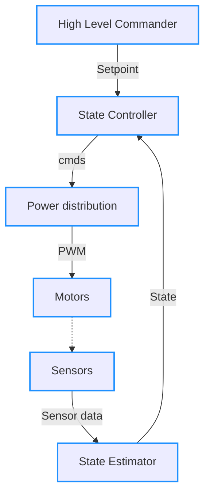
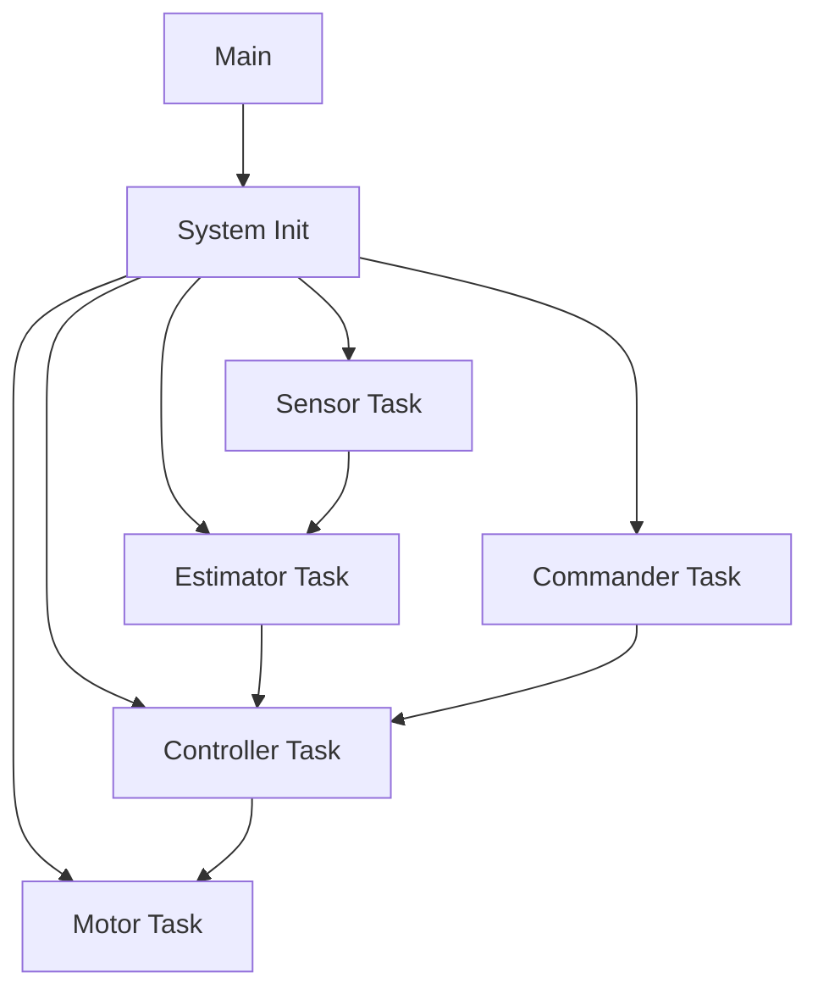
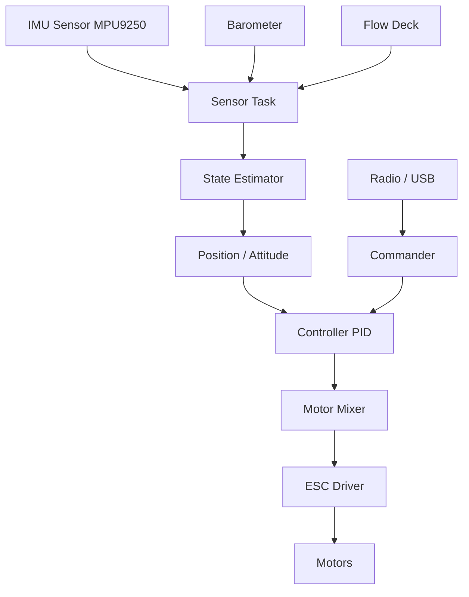

| Supported Targets | ESP32-S3 |
| ----------------- | -------- |


| Device                          | Interface | ESP32-S3 Pin | Sensor Pin  | Notes                         |
| ------------------------------- | --------- | ------------ | ----------- | ----------------------------- |
| **VL53L1X ToF Distance Sensor** | I2C       | GPIO8        | SDA         | Shared I2C bus                |
|                                 | I2C       | GPIO9        | SCL         | Shared I2C bus                |
|                                 | GPIO      | GPIO7        | XSHUT       | Optional reset control        |
|                                 | Power     | 3V3          | VIN         | 3.3V supply                   |
|                                 | GND       | GND          | GND         | Common ground                 |
| **MPU6050 IMU**                 | I2C       | GPIO8        | SDA         | Shared with VL53L1X           |
|                                 | I2C       | GPIO9        | SCL         | Shared with VL53L1X           |
|                                 | Power     | 3V3          | VCC         | 3.3V supply                   |
|                                 | GND       | GND          | GND         | Common ground                 |
| **PMW3901 Optical Flow Sensor** | SPI       | GPIO12       | MOSI        | SPI bus                       |
|                                 | SPI       | GPIO13       | MISO        | SPI bus                       |
|                                 | SPI       | GPIO11       | SCLK        | SPI clock                     |
|                                 | SPI       | GPIO10       | CS          | Chip select                   |
|                                 | GPIO      | GPIO14       | INT         | Motion interrupt (optional)   |
|                                 | Power     | 3V3          | VCC         | 3.3V supply                   |
|                                 | GND       | GND          | GND         | Common ground                 |
| **SBUS Receiver**               | UART RX   | GPIO17       | SBUS Signal | Use UART with inverted signal |
|                                 | Power     | 5V / 3V3     | VCC         | Depends on receiver           |
|                                 | GND       | GND          | GND         | Common ground                 |
| **WS2812B RGB LED**             | GPIO      | GPIO18       | DIN         | Data signal                   |
|                                 | Power     | 5V           | VCC         | LED supply                    |
|                                 | GND       | GND          | GND         | Common ground                 |


# Overview

# FreeRTOS task architecture


# System Architecture


### Configure the project

```
idf.py menuconfig
```

* Set WiFi mode (station or SoftAP) under Example Configuration Options.
* Set ESPNOW primary master key under Example Configuration Options.
  This parameter must be set to the same value for sending and recving devices.
* Set ESPNOW local master key under Example Configuration Options.
  This parameter must be set to the same value for sending and recving devices.
* Set Channel under Example Configuration Options.
  The sending device and the recving device must be on the same channel.
* Set Send count and Send delay under Example Configuration Options.
* Set Send len under Example Configuration Options.
* Set Enable Long Range Options.
  When this parameter is enabled, the ESP32 device will send data at the PHY rate of 512Kbps or 256Kbps
  then the data can be transmitted over long range between two ESP32 devices.

# Drone Flight Control Architecture (ESP32 + FreeRTOS)
```mermaid
flowchart TD
    %% Cảm biến
    subgraph Sensors [Cảm biến]
        IMU[MPU6050 / IMU]
        ToF[VL53L1X / ToF]
    end

    %% Task chính
    subgraph MainTasks [Task chính]
        IMUTask[IMU Task - Đọc MPU6050]
        ToFTask[ToF Task - Đọc VL53L1X]
        AngleEstimatorTask[Angle Estimator Task - Ước lượng góc]
        PIDTask[PID Controller Task - Điều khiển PID]
        MotorTask[Motor Control Task - Điều khiển động cơ]
    end

    %% Task phụ
    subgraph AuxTasks [Task phụ]
        CommTask[Communication Task - Giao tiếp PC/RC]
        TelemetryTask[Telemetry Task - Gửi dữ liệu về đất]
        LoggerTask[Logger Task - Ghi log dữ liệu]
    end

    %% Động cơ
    subgraph Motors [Động cơ & ESC]
        Motor1[Motor 1]
        Motor2[Motor 2]
        Motor3[Motor 3]
        Motor4[Motor 4]
    end

    %% Queue/Semaphore
    subgraph IPC [Queue/Semaphore]
        imuQueue[IMU→Estimator Queue]
        tofQueue[ToF→Estimator Queue]
        estimatorQueue[Estimator→PID Queue]
        pidQueue[PID→Motor Queue]
        commQueue[Comm→PID Queue]
        telemetryQueue[Telemetry Buffer]
        loggerQueue[Logger Buffer]
        motorSem[Motor Control Semaphore]
    end

    %% Luồng dữ liệu cảm biến
    IMU -->|I2C| IMUTask
    ToF -->|I2C| ToFTask

    %% IMU Task gửi dữ liệu vào queue cho Angle Estimator
    IMUTask -->|Dữ liệu IMU| imuQueue
    ToFTask -->|Dữ liệu ToF| tofQueue

    %% Angle Estimator nhận dữ liệu từ queue, gửi kết quả cho PID
    imuQueue --> AngleEstimatorTask
    tofQueue --> AngleEstimatorTask
    AngleEstimatorTask -->|Attitude/Altitude| estimatorQueue

    %% PID Controller nhận setpoint từ Communication, dữ liệu từ Estimator
    commQueue --> PIDTask
    estimatorQueue --> PIDTask

    %% PID Controller gửi lệnh tới Motor Control
    PIDTask -->|Motor Command| pidQueue
    pidQueue -->|PWM/DShot| MotorTask

    %% Motor Control xuất tín hiệu tới động cơ
    MotorTask -->|PWM/DShot| Motor1
    MotorTask -->|PWM/DShot| Motor2
    MotorTask -->|PWM/DShot| Motor3
    MotorTask -->|PWM/DShot| Motor4

    %% Semaphore đồng bộ hóa Motor Control
    MotorTask --> motorSem

    %% Communication Task nhận lệnh từ PC/RC, gửi setpoint cho PID
    CommTask -->|Lệnh điều khiển| commQueue

    %% Telemetry Task nhận dữ liệu từ các task, gửi về đất
    AngleEstimatorTask --> telemetryQueue
    PIDTask --> telemetryQueue
    MotorTask --> telemetryQueue
    TelemetryTask -->|CRTP/Radio/BLE| CommTask

    %% Logger Task ghi log dữ liệu từ các task
    AngleEstimatorTask --> loggerQueue
    PIDTask --> loggerQueue
    MotorTask --> loggerQueue
    LoggerTask -->|Lưu trữ/Truyền về đất| CommTask
    PIDTask --> loggerQueue
    MotorTask --> loggerQueue
    LoggerTask -->|Lưu trữ/Truyền về đất| CommTask
