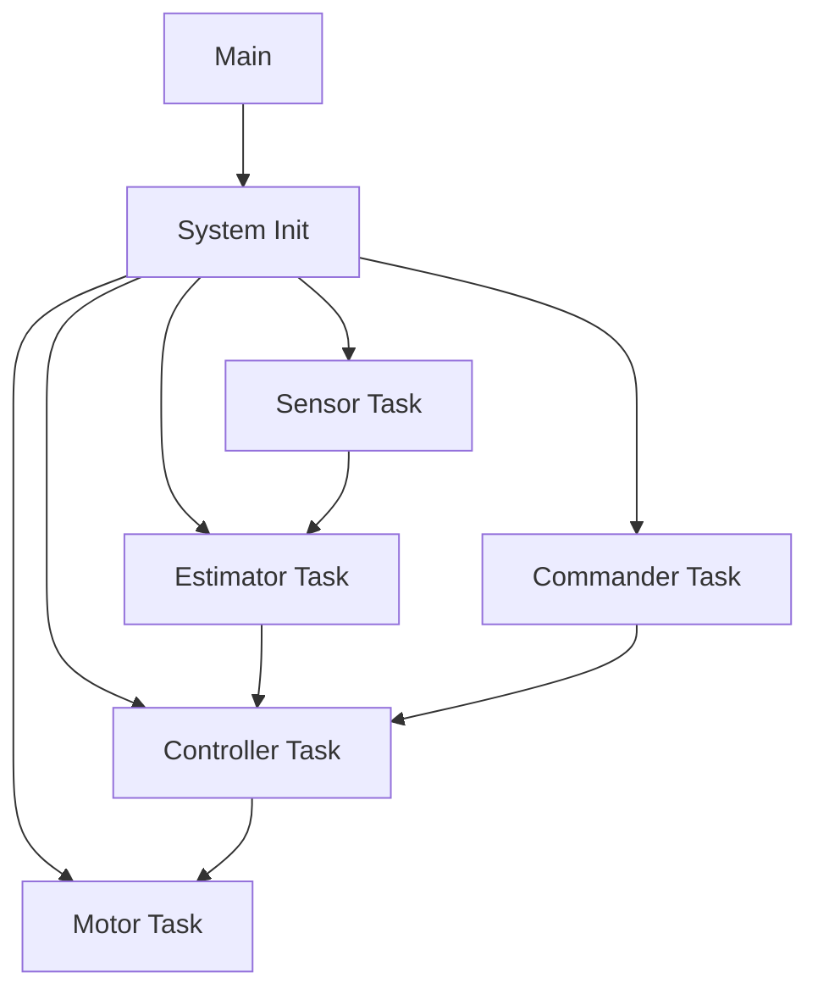
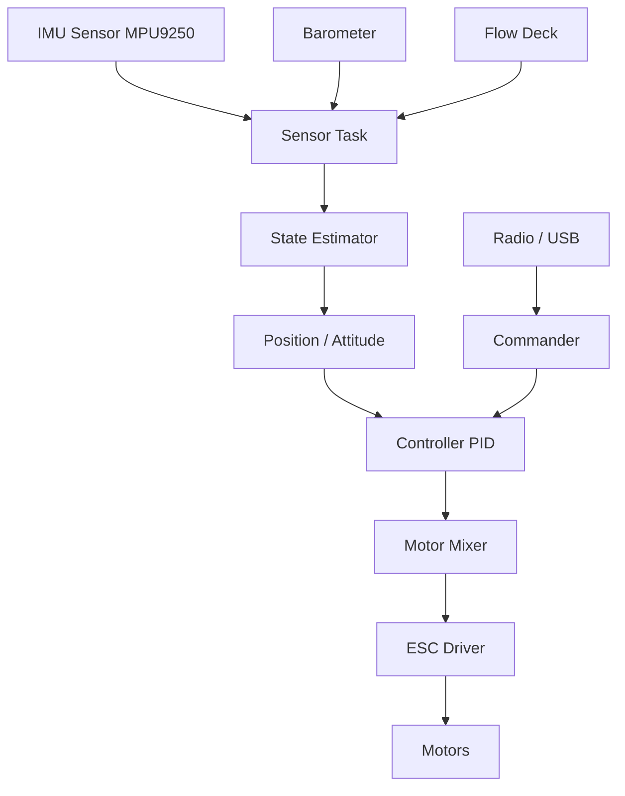

| Supported Targets | ESP32-S3 |
| ----------------- | -------- |

# Sensor Data Flow

# FreeRTOS task architecture


# System Architecture


### Configure the project

```
idf.py menuconfig
```

* Set WiFi mode (station or SoftAP) under Example Configuration Options.
* Set ESPNOW primary master key under Example Configuration Options.
  This parameter must be set to the same value for sending and recving devices.
* Set ESPNOW local master key under Example Configuration Options.
  This parameter must be set to the same value for sending and recving devices.
* Set Channel under Example Configuration Options.
  The sending device and the recving device must be on the same channel.
* Set Send count and Send delay under Example Configuration Options.
* Set Send len under Example Configuration Options.
* Set Enable Long Range Options.
  When this parameter is enabled, the ESP32 device will send data at the PHY rate of 512Kbps or 256Kbps
  then the data can be transmitted over long range between two ESP32 devices.

### Build and Flash

Build the project and flash it to the board, then run monitor tool to view serial output:

```
idf.py -p PORT flash monitor
```

(To exit the serial monitor, type ``Ctrl-]``.)

See the Getting Started Guide for full steps to configure and use ESP-IDF to build projects.

## Example Output

Here is the example of ESPNOW receiving device console output.

```
I (898) phy: phy_version: 3960, 5211945, Jul 18 2018, 10:40:07, 0, 0
I (898) wifi: mode : sta (30:ae:a4:80:45:68)
I (898) espnow_example: WiFi started
I (898) ESPNOW: espnow [version: 1.0] init
I (5908) espnow_example: Start sending broadcast data
I (6908) espnow_example: send data to ff:ff:ff:ff:ff:ff
I (7908) espnow_example: send data to ff:ff:ff:ff:ff:ff
I (52138) espnow_example: send data to ff:ff:ff:ff:ff:ff
I (52138) espnow_example: Receive 0th broadcast data from: 30:ae:a4:0c:34:ec, len: 200
I (53158) espnow_example: send data to ff:ff:ff:ff:ff:ff
I (53158) espnow_example: Receive 1th broadcast data from: 30:ae:a4:0c:34:ec, len: 200
I (54168) espnow_example: send data to ff:ff:ff:ff:ff:ff
I (54168) espnow_example: Receive 2th broadcast data from: 30:ae:a4:0c:34:ec, len: 200
I (54168) espnow_example: Receive 0th unicast data from: 30:ae:a4:0c:34:ec, len: 200
I (54678) espnow_example: Receive 1th unicast data from: 30:ae:a4:0c:34:ec, len: 200
I (55668) espnow_example: Receive 2th unicast data from: 30:ae:a4:0c:34:ec, len: 200
```

Here is the example of ESPNOW sending device console output.

```
I (915) phy: phy_version: 3960, 5211945, Jul 18 2018, 10:40:07, 0, 0
I (915) wifi: mode : sta (30:ae:a4:0c:34:ec)
I (915) espnow_example: WiFi started
I (915) ESPNOW: espnow [version: 1.0] init
I (5915) espnow_example: Start sending broadcast data
I (5915) espnow_example: Receive 41th broadcast data from: 30:ae:a4:80:45:68, len: 200
I (5915) espnow_example: Receive 42th broadcast data from: 30:ae:a4:80:45:68, len: 200
I (5925) espnow_example: Receive 44th broadcast data from: 30:ae:a4:80:45:68, len: 200
I (5935) espnow_example: Receive 45th broadcast data from: 30:ae:a4:80:45:68, len: 200
I (6965) espnow_example: send data to ff:ff:ff:ff:ff:ff
I (6965) espnow_example: Receive 46th broadcast data from: 30:ae:a4:80:45:68, len: 200
I (7975) espnow_example: send data to ff:ff:ff:ff:ff:ff
I (7975) espnow_example: Receive 47th broadcast data from: 30:ae:a4:80:45:68, len: 200
I (7975) espnow_example: Start sending unicast data
I (7975) espnow_example: send data to 30:ae:a4:80:45:68
I (9015) espnow_example: send data to 30:ae:a4:80:45:68
I (9015) espnow_example: Receive 48th broadcast data from: 30:ae:a4:80:45:68, len: 200
I (10015) espnow_example: send data to 30:ae:a4:80:45:68
I (16075) espnow_example: send data to 30:ae:a4:80:45:68
I (17075) espnow_example: send data to 30:ae:a4:80:45:68
I (24125) espnow_example: send data to 30:ae:a4:80:45:68
```

## Troubleshooting

If ESPNOW data can not be received from another device, maybe the two devices are not
on the same channel or the primary key and local key are different.

In real application, if the receiving device is in station mode only and it connects to an AP,
modem sleep should be disabled. Otherwise, it may fail to revceive ESPNOW data from other devices.
